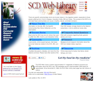
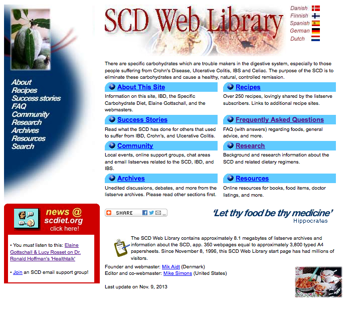

# scdiet.org



Archive of the original SCDiet.org site created by [Mik Aidt](https://twitter.com/mikaidt) and [Mike Simons](http://www.glassbird.com/)

From 1996 through September 2016, this site lived at ```www.scdiet.org```.  It was created to help people use the Specific Carbohydrate Diet (SCD) as described in Elaine Gottschall's book Breaking the Vicious Cycle.

As described in the site's footer:

> The SCD Web Library contains approximately 8.1 megabytes of listserve archives and information about the SCD, app. 350 webpages equal to approximately 3,800 typed A4 papersheets.

This archive contains the static HTML and images from the site.

Please see the [releases tab](https://github.com/raprasad/scdiet.org/releases) for:

## Original Version https://github.com/raprasad/scdiet.org/releases/tag/1.0

  - In the [original version](https://github.com/raprasad/scdiet.org/releases/tag/1.0) pages are hardcoded with links to "http://www.scdiet.org"

  - In this version the site only works when running from the www.scdiet.org domain.

## SCDArchive version https://github.com/raprasad/scdiet.org/releases/tag/2.0

  - For this [scdarchive version](https://github.com/raprasad/scdiet.org/releases/tag/2.0), all the links to ```http://www.scdiet.org``` have been changed to ```/scdarchive```

  - This allows the "scdarchive" folder and files to be copied onto an existing web server.

#### Running the "scdarchive" version locally

  - Open a Terminal window
  - cd into this project's main directory
    - ```cd ~/scdiet.org```
    - This directory contains the ```scdarchive``` folder
  - start a python server  
    - ```python -m SimpleHTTPServer 8000```
  - Go to http://0.0.0.0:8000/scdarchive

---

The homepage of the site:



---

## Replace sequences

### Original version to "archive subdirectory" version

Here is the replace sequence run to go from the original version to one which may be served from the subdirectory of a webserver.

 - REPLACE ```href="http://www.scdiet.org/``` WITH ```href="/scdarchive/```
 - REPLACE ```href="http://www.scdiet.org"``` WITH ```href="/scdarchive"```
 - REPLACE ```src="http://www.scdiet.org/``` WITH ```src="/scdarchive/```
 - REPLACE ```value="http://www.scdiet.org/``` WITH ```value="/scdarchive/```
 - REPLACE ```xml:base="http://www.scdiet.org/news``` WITH ```xml:base="/scdarchive/news```
 - REPLACE ```URL=http://www.scdiet.org"``` WITH ```URL=/scdarchive"```
 - REPLACE ```HREF="http://www.scdiet.orgdk``` WITH ```href="/scdarchive/dk```
   - This was a bad link in the original version
 - REPLACE ```open ("http://www.scdiet.org/``` WITH ```open ("/scdarchive/```
